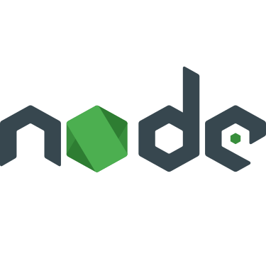

<h1 align="center">Hi 👋, I'm zenith, 🌟 Top Glowing Star 🔭</h1>
<h3 align="center">professional programmer that loves physics</h3>

* ✉ email : <a href="versatile.skydev@gmail.com">versatile.skydev@gmail.com</a>

* 📞 skype : <a href="https://join.skype.com/invite/sTcIbKLV2x6u">🌟zenith🌟</a>

- 💻 I’m currently working as freelancer

- 💬 Ask me about **C++** & **Rust** & **Python** & **JavaScript** & **Blockchain**

- ⚡ Fun fact **50% of programming is coding, the rest 50% is debugging**

<h3 align="left">Languages and Tools:</h3>

 
     &nbsp; 
     &nbsp; 
     &nbsp; 
     &nbsp;
     &nbsp;
     &nbsp;
     &nbsp;
    
     &nbsp;

