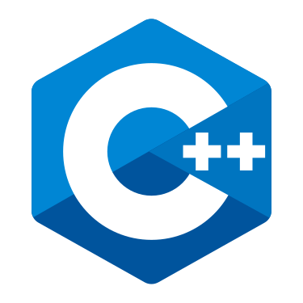

# zenith
🌟 Top Glowing Star 🔭
(professional programmer that loves physics)

[a link](versatile.skydev@gmail.com)

## Skills

  
  
  
  
  
  
  

## experiences

### C++
* experience of 5+ years
* developed medium and big software using OpenSSL, OpenGL, OpenCV, Boost, and etc
* favourite IDE is qt and visual studio
* developed several program with open-source
* c++ is the most favourite language

### Rust
* experience of 3 years
* deep knowledge about rust design patters
* developed cross-platform programs 
* developed several back-end software using Actix, Rocket, and Tide
* contributed to some crate library

### React.js
* experience of 2 years

### Angular.js
* experience of 1 year

### Tauri
* experience of 2 years

### Solana
* experience of 1 years

### Cosmwasm
* experience of 1 years
